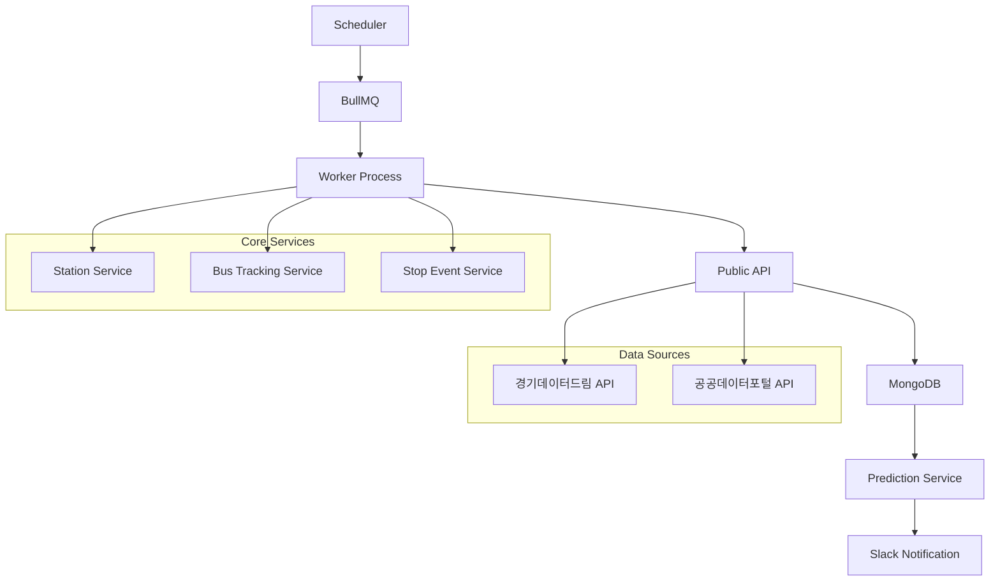
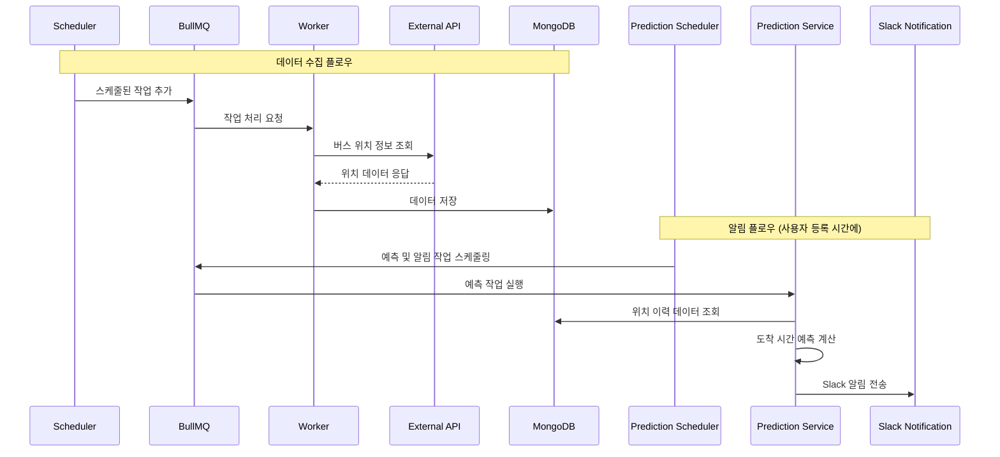

# 🚌 버스 정류장 모니터링 시스템 (v1)

## 📋 프로젝트 개요

### 🎯 프로젝트 목적
- 고양시 버스정류장에 정차하는 노선들의 위치 정보를 일정 시간동안 주기적으로 수집
- 수집된 데이터를 기반으로 특정 노선의 특정 정류장 도착 시간 예측
- 사용자가 지정한 시간대에 버스 도착 예정 시간을 Slack으로 알림

### 🛣️ 로드맵
- **Phase 1 (완료)**: 실시간 버스 위치 정보 수집 및 저장
- **Phase 2 (진행 중)**: 예측 시간 계산 및 Slack 알림 기능
- **Phase 3 (예정)**: 전국 버스정류장 정보 확대 및 전국 노선 지원

## 🏗️ 시스템 아키텍처




## 🛠️ 기술 스택

### Backend
- **Node.js** with **TypeScript**
- **NestJS**

### Database & Storage
- **MongoDB** Atlas Cloud
- **Redis** - BullMQ 작업 큐 백엔드

### Job Queue & Scheduling
- **BullMQ** - 백그라운드 작업 큐 관리
- **node-cron** - 스케줄링

### External APIs
- **경기데이터드림 API** - 버스 정류장 정보
- **공공데이터포털 API** - 버스 노선 및 위치 정보

### DevOps & Monitoring
- **Winston** - 로깅
- **Jest** - 테스트 코드 환경
- **Jenkins** - CI/CD

## 📁 프로젝트 구조

```
src/
├── config/                    # 설정 파일
│   ├── config.ts             # 메인 설정
│   └── logger.config.ts      # 로거 설정
├── jobs/                     # 백그라운드 작업
│   ├── batch.controller.ts   # 배치 작업 컨트롤러
│   ├── batch.module.ts       # 배치 모듈
│   ├── bus-tracking.service.ts        # 버스 추적 서비스
│   ├── bus-tracking-processor.ts      # 버스 추적 프로세서
│   ├── station-update.service.ts      # 정류장 업데이트 서비스
│   └── station-update-processor.ts    # 정류장 업데이트 프로세서
├── modules/                  # 핵심 비즈니스 모듈
│   ├── apis/                # 외부 API 연동
│   │   ├── bus-route-info.ts
│   │   ├── bus-stop-info.ts
│   │   ├── constants/
│   │   ├── decorators/
│   │   └── interfaces/
│   ├── bus-tracking/        # 버스 추적 모듈
│   ├── station/             # 정류장 관리 모듈
│   ├── stop-event/          # 정차 이벤트 모듈
│   └── public/              # 공개 API 모듈
├── models/                  # 데이터 모델
└── tests/                   # 테스트 파일
```

## 🚀 Start

### 사전 요구사항
- Node.js (v18+)
- MongoDB
- Redis
- 경기데이터드림 API 키
- 공공데이터포털 API 키

### 설치 및 실행

1. **의존성 설치**
```bash
npm install
```

2. **설정 파일 구성**
```yaml
# config/config.yaml
http:
  port: 3000

mongo:
  url: 'your-mongodb-connection-string' # user mongodb url

redis:
  host: 'localhost' # user redis host
  port: 6379

publicApi:
  stationInfoUrl: 'https://openapi.gg.go.kr/BusStation'
  serviceKey: '' # your-gg-api-key
  busRouteServiceUrl: 'https://apis.data.go.kr/6410000'
  routeServiceKey: '' # your-public-data-api-key
```

## 📊 주요 기능

### ✅ 완료된 기능
- **실시간 버스 위치 정보 수집**: 트래킹 요청 노선별 실시간 위치 데이터 수집 및 저장
- **Jenkins CI/CD 환경 구성**: 브랜치 선택 기반 빌드 환경 구축
- **정류장 정보 관리**: 고양시 버스 정류장 정보 수집 및 관리
- **배치 작업 시스템**: BullMQ 기반 백그라운드 작업 처리

### 🚧 개발 진행중
- **버스 도착 시간 예측**: 수집된 위치 데이터 기반 도착 시간 예측
- **Slack 알림 시스템**: 예측된 도착 시간을 Slack으로 전송
- **주기적 버스 정보 알림**: 사용자 설정 기반 정기 알림

### 📅 향후 계획
- **전국 버스 정류장 확대**: 고양시에서 전국으로 서비스 범위 확장

## 🔗 API 엔드포인트

### 공개 API
```
정류소명/번호 목록조회
GET https://www.gbis.go.kr/gbis2014/publicService.action?cmd=mBusStation

정류소 경유노선 목록조회  
GET https://www.gbis.go.kr/gbis2014/publicService.action?cmd=mBusStationRoute

버스위치정보 조회 서비스
GET https://www.gbis.go.kr/gbis2014/publicService.action?cmd=mBusLocation
```

## 📈 서비스 플로우

